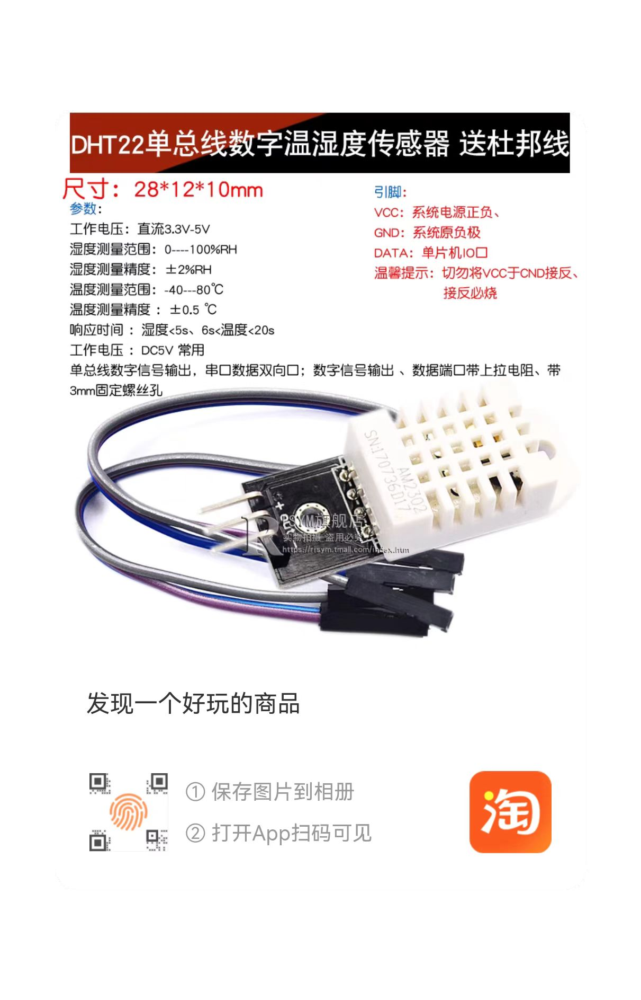

# pi5-dht22-tools

使用树莓派 Pi5 读取 DHT22 温湿度传感器数据的示例脚本。

下图展示了传感器与树莓派连接示例：



## 环境准备
1. 推荐使用虚拟环境管理依赖：
   ```bash
   python3 -m venv .venv
   source .venv/bin/activate
   pip install lgpio adafruit-circuitpython-dht
   ```
2. 将 DHT22 按以下方式连接至树莓派：
   - VCC 接 3.3V（例如针脚 1）
   - GND 接 GND（例如针脚 6）
   - DATA 接 GPIO4（针脚 7，可在 `main.py` 中更改）
   - 若使用裸传感器，需要在 VCC 与 DATA 之间串联约 10kΩ 的上拉电阻（部分模块已内置）

## 运行脚本
运行脚本（持续读取）：
```bash
python3 main.py --pin 4
```

可通过 `--interval` 指定读取间隔（秒），`--pin` 指定传感器连接的 GPIO 引脚。
